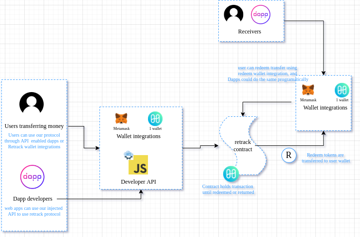

# retrack-protocol
More than 40 Billion dollars worth of Ether have already been lost to the ether ( no pun intended) because of the wrong recipient address. Moreover 8 Million Dollars worth of coins are lost each year. But these errors are more than just typos. The same thing for instance happened to us. We lost $10,000 of a harmony grant because of a wrong custodial Crypto.com eth address. Had there been a system like retrack protocol that money would have easily been recovered. Retrack is aiming to be the ERC-20 standard of safe transactions via a retractable funds protocol. It acts as an intermediary between senders and receivers, allowing senders to retract funds if they have sent it to an incorrect address. We are currently building two web3 projects, both of which will be dependent on the existence of such a system. The first project is Execblock, a public credential verification system. This is the project we are currently building on Harmony. The second one is a web3 credit system. This one will be even more dependent on such a protocol as retractable transactions are a key part of credit cards. These applications however are just from our side, we believe this protocol will become the base for multiple dapps and defis to come and our aim is to provide safer transactions for this use cases on Harmony.

## Demo link:
Deployed contract can be found at [this]() address.

## How it works

How the retrack protocol works: When a user chooses to pay with retrack, they pay to our smart contract rather than directly to the designated user. We will then send the designated recipient an equivalent standard in our tethered native token. The recipient can then claim the funds by exchanging the native token back for the payment amount stored in our contract. However, if the money was actually sent to the wrong account and thus there is no one who can exchange the native token back, the original sender can refund their funds back and we will provide them with their funds along with burning the tokens provided to the recipient. We additionally have a 7 day buffer period where if no one claims an action from either side, the payment is returned to the sender account. Thus, we are creating the first safe transfer service to protect against sending money to dead/unknown addresses.

## Technologies
`Solidity`
`Python (brownie)`
`HTML/CSS`

## Test version

Here is a demo of the protocol on testnet. 

<video src="https://www.youtube.com/watch?v=BhCPNMv85m0" width=180/>

## Setup
- To get started clone the project
- Then inside the cloned projects start a virtual environment
    and install python-brownie
Folder structure
[scripts](./scripts) - scripts for deploying and testing contract
[contracts](./contracts) - contract code
[tests](./tests) - Client and server side code for testing protocol

## License

MIT license @ [Hileamlak Yitayew](https://github.com/hileamlakb)
